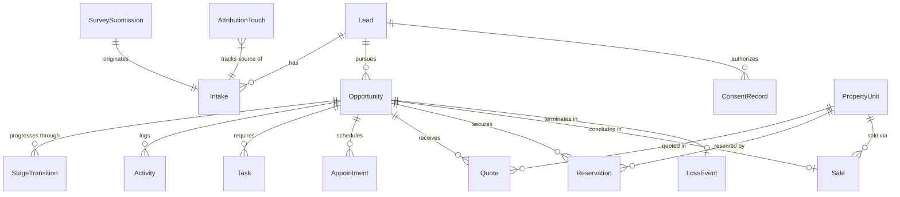
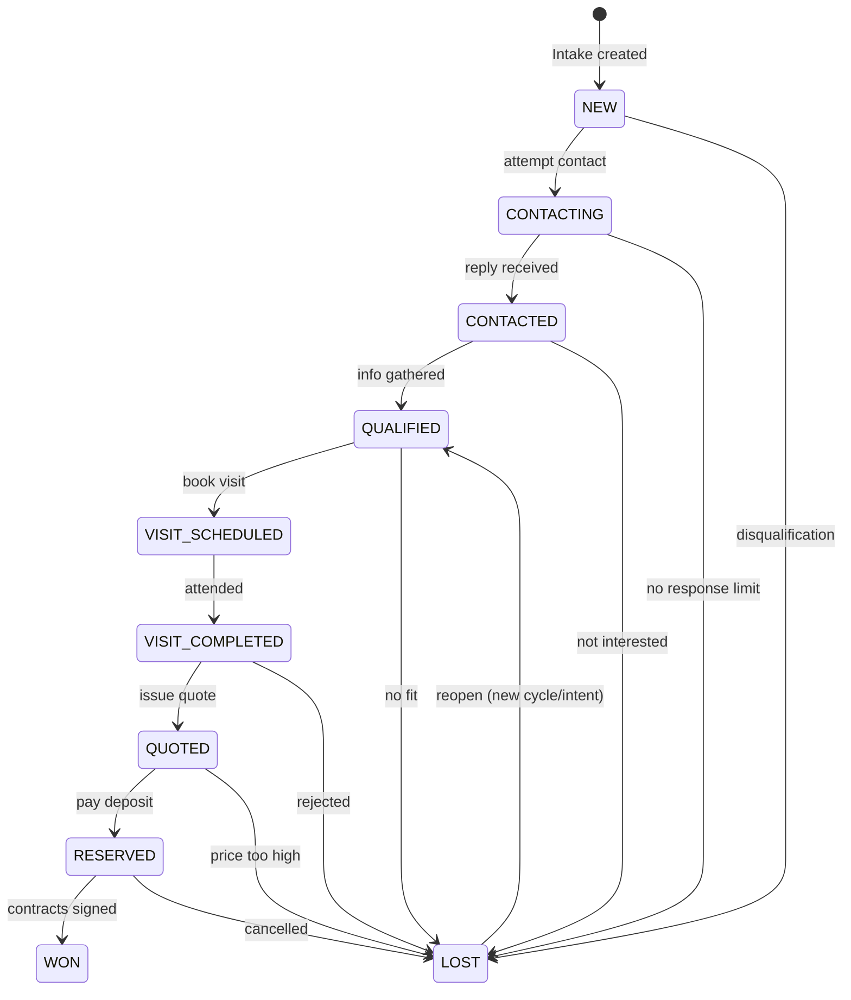

# Modelo de Dominio - Quirá OS V2

## 1. Entidades Principales

### Identity & Access
- `User`: Asesoras, Dirección, TriMind y Administradores.
- `Organization` y `Project`: El contexto multitenant y el proyecto inmobiliario (Quirá Reservado).

### Lead & Intake (Adquisición)
- `Lead`: Persona única, identificada y normalizada.
- `ConsentRecord`: Base legal para contactar y almacenar datos del Lead.
- `Intake`: Evento de captura en el que el Lead entra al sistema (encuesta, sala, referido).
- `SurveySubmission`: Respuestas a un cuestionario que derivan en un Intake.
- `AttributionTouch`: Punto de contacto de marketing (campaña, creativo, UTM) asociado a un Intake.

### Opportunity & Pipeline (Conversión)
- `Opportunity`: Intento de compra para un proyecto y ciclo comercial específico. Tiene una etapa actual y una disposición.
- `Activity`: Acciones pasadas y notas (llamadas, WhatsApp, registros manuales).
- `Task`: Acciones futuras planificadas con responsable y fecha límite.
- `Appointment` & `Visit`: Eventos agendados y su confirmación de asistencia en el proyecto.
- `StageTransition`: Registro inmutable (append-only) de cada cambio de etapa de la oportunidad.
- `Objection` & `LossEvent`: Registro estructurado de barreras comerciales o pérdida definitiva.

### Inventory & Closing (Transaccional)
- `Tower` & `PropertyUnit`: Inventario estructurado con disponibilidad y precios.
- `Quote` & `QuoteLine`: Oferta económica versionada asociada a una unidad.
- `Reservation`: Separación comercial temporal de la unidad.
- `Sale`: Venta confirmada tras verificaciones contractuales.

## 2. Diagrama de Relaciones (ERD Lógico)

## 3. Máquina de Estados (Oportunidad)

